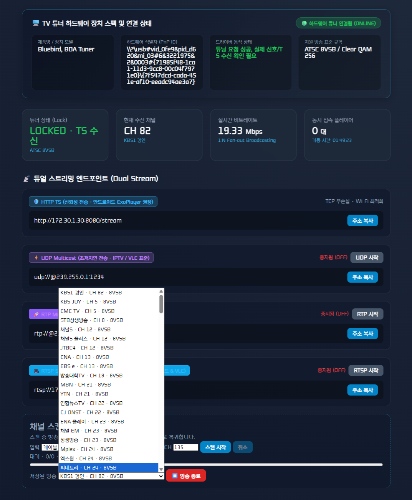
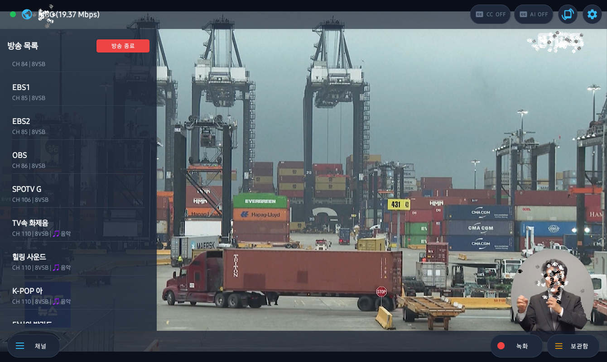
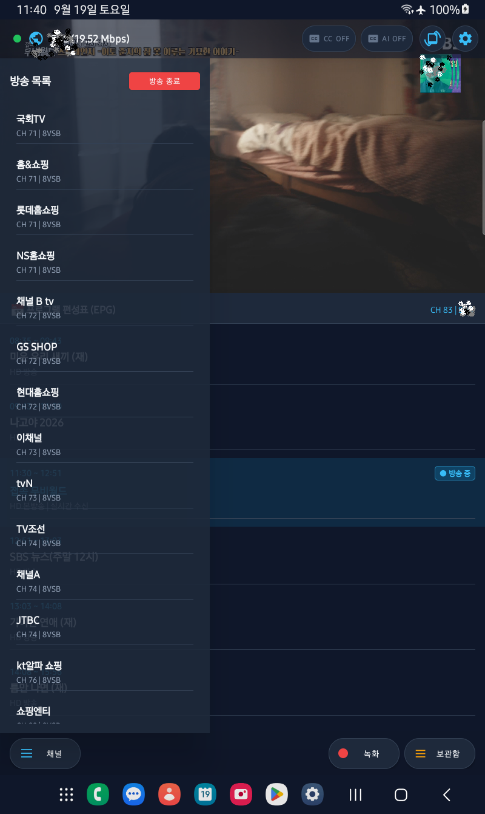

# TV(ATSC) TS(Transport Stream) Server

Windows USB TV 튜너에서 수신한 방송을 HTTP와 UDP 멀티캐스트로 전달하는 서버입니다.
공개 서버 소스와 별도 배포되는 비공개 `SidewayTunerCore.dll`로 구성합니다. 전체 제품이 오픈소스인 것은 아닙니다.

공개 서버 코드·SDK API 헤더는 Apache-2.0([LICENSE](LICENSE))입니다. 비공개 DLL·import LIB는 [별도 바이너리 배포 조건](BINARY_LICENSE.md)을 적용합니다. 서드파티 코드는 원래 라이선스를 따릅니다.

---

개발 후기 : https://side-ways.tistory.com/6, https://blog.naver.com/ibook/224414714816
사용 후기 : https://side-ways.tistory.com/7, https://blog.naver.com/ibook/224414714816

## 구성

- 공개: 실행 옵션·웹 UI·HTTP/UDP 전송·구독자 버퍼·채널 JSON 형식·DLL 어댑터·모의 테스트.
- 비공개 DLL: BDA 장치 제어·스캔·방송 테이블 분석·선택 서비스 구성·장치 호환성 처리.
- 배포 바이너리 (`release/`): 즉시 실행 가능한 `sideway-ts-server.exe`, 실제 하드웨어 튜너 코어 `SidewayTunerCore.dll`, 빌드용 `SidewayTunerCore.lib`. 별도 빌드 없이 바로 실행할 수 있습니다.
- SDK 규격: [DLL API](docs/DLL_API.md), [공개 및 배포 범위](docs/공개_배포_범위.md).

## 프로젝트 디렉토리 구조

```text
C:\ws\ts\server
├── README.md                                   # 서버 사양, 웹 대시보드, 빌드/실행 및 REST API 문서
├── CMakeLists.txt / CMakePresets.json          # C++20 / MSVC / CMake 빌드 환경 설정
├── .env / .env.example                         # 서버 환경 설정 파일
├── LICENSE / BINARY_LICENSE.md                 # 공개 소스(Apache-2.0) 및 비공개 코어 DLL 배포 조건
├── docs/                                       # 상세 모듈 사양 및 변경 기록 문서
│   ├── 변경_기록.md                             # RTSP 동적 토글 및 품질 설정 연동 기록
│   ├── DLL_API.md                              # BDA 튜너 코어 SDK API 규격
│   ├── EPG_API.md                              # 실시간 EPG REST API 가이드
│   └── 공개_배포_범위.md                        # 오픈소스 및 비공개 라이브러리 범위
├── include/                                    # C++ 헤더 파일
│   ├── HttpStreamer.h                          # HTTP TS 스트리머 및 REST API 핸들러
│   ├── RtspStreamer.h                          # RFC 2326 / RFC 3550 RTSP 스트리머 (TCP Interleaved)
│   ├── QualityConfig.h                         # 디코딩/스트리밍 품질 동적 설정 모델
│   └── WebDashboard.h                          # 웹 대시보드 HTML/JS 및 동적 상태 제어
├── src/                                        # C++ 구현 파일
│   ├── HttpStreamer.cpp                        # HTTP/REST API 서버 및 세션 관리
│   ├── RtspStreamer.cpp                        # RTSP 상태 머신 및 TCP/UDP RTP 송출
│   └── main.cpp                                # 서버 진입점 및 서비스 초기화
├── release/                                    # 즉시 실행 가능한 사전 빌드 바이너리
│   ├── sideway-ts-server.exe                   # 최신 서버 실행 파일 (381 KB)
│   ├── SidewayTunerCore.dll                    # 실제 하드웨어 BDA 튜너 제어 코어 DLL
│   └── SidewayTunerCore.lib                    # SDK 링크 라이브러리
└── tests/                                      # CTest 및 Node.js 대시보드 회귀 테스트
    └── DashboardTests.js                       # 대시보드 UI/REST API 자동 검증 스크립트
```

## 빌드

Windows x64, Visual Studio C++ 도구, Windows SDK, CMake 3.20 이상이 필요합니다. 웹 테스트에는 Node.js를 사용합니다.

```powershell
cmake -S . -B build -A x64 -DTUNER_CORE_SDK=C:/SDK/SidewayTunerCore
cmake --build build --config Release
ctest --test-dir build -C Release --output-on-failure
```

SDK의 `bin/SidewayTunerCore.dll`을 실행 파일 옆에 복사합니다. SDK 없이도 공개 소스의 빌드·모의 테스트는 가능하지만 실제 TV 수신에는 DLL이 필요합니다. 서버는 실행 파일 옆 DLL만 로드하며 API 버전 불일치·누락 시 오류를 표시합니다. x64용 Microsoft Visual C++ 런타임이 필요할 수 있습니다.

## 실행

사전 빌드된 `release` 폴더의 바이너리를 사용하거나 직접 빌드한 실행 파일을 실행합니다.

```powershell
# [사전 빌드 바이너리 바로 실행 - 권장]
.\release\sideway-ts-server.exe

# 옵션 사용 예시
.\release\sideway-ts-server.exe --scan
.\release\sideway-ts-server.exe --no-scan
.\release\sideway-ts-server.exe --channels C:/TV/channels.json
```

- 실행 파일 옆 `channels.json`에 방송 목록·마지막 선택을 저장합니다. 없거나 비어 있으면 자동 스캔합니다.
- `--scan`은 강제 검색, `--no-scan`은 자동 검색 생략입니다. 동시에 사용할 수 없습니다.
- 기본 검색은 케이블 8VSB CH 2~135입니다. 웹에서 입력 방식·변조·범위를 변경합니다. 지역별 주파수표에 따라 검색 결과가 달라집니다.
- 웹 대시보드: http://localhost:8080/

### 🌐 웹 관리자 대시보드 UI (Web Dashboard)



- 웹 대시보드의 **`[선택 방송 재생] ↔ [방송 종료]`** 버튼으로 실시간 방송 수신을 토글할 수 있습니다. 방송 종료 시 튜너 장치 점유를 완전히 해제하여 다른 프로그램과의 충돌을 방지합니다.
- HTTP 스트림: http://localhost:8080/stream
- UDP 스트림: `udp://@239.255.0.1:1234` (기본 정지/OFF 상태, 웹 대시보드 또는 API로 켤 수 있음)
- RTP 스트림: `rtp://@239.255.0.1:5004` (기본 정지/OFF 상태, RFC 2250 / RFC 3550 기반 패킷 동기화 스트리밍, VLC 플레이어 권장)
- 다른 기기에서는 localhost 대신 서버 PC의 LAN IP를 사용합니다.
- 스캔 중 시청이 중단됩니다. 완료·취소 후 이전 방송으로 복귀하며 플레이어 재연결이 필요할 수 있습니다.
- 취소·빈 결과로 기존 JSON을 덮어쓰지 않습니다. 부분 스캔은 범위 밖 방송을 보존합니다.
- 한 개 튜너의 채널 변경은 모든 시청자에게 적용됩니다.
- Android VLC 호환성을 위해 송출에서 PSIP를 제외합니다. 스캔·웹 이름은 유지되지만 플레이어에 원본 PSIP 방송 이름·편성 정보가 전달되지 않습니다.
- 서버에는 접속 인증이 없습니다. 인터넷에 직접 포트를 공개하지 말고 신뢰할 수 있는 내부망에서 사용합니다.

## API

| 요청 | 기능 |
|---|---|
| GET /api/status | 장치·수신 상태 (UDP/RTP 송출 여부 포함) |
| GET /api/channels | 저장 방송 목록 |
| GET /api/scan | 스캔 진행 상태 |
| GET /api/epg | 선택 방송의 EPG·현재/다음 프로그램 JSON |
| GET /api/caption | 실시간 DTV Closed Caption(CEA-708) 폐쇄자막 및 제어코드 JSON |
| POST /api/udp/enabled | UDP 송출 상태 지정 (`enabled`) |
| POST /api/rtp/enabled | RTP 송출 상태 지정 (`enabled`) |
| POST /api/rtsp/enabled | RTSP 송출 상태 지정 (`enabled`) |
| POST /api/scan/start?input=cable&modulation=8VSB&first=2&last=135 | 검색 시작 |
| POST /api/scan/cancel | 검색 취소 |
| POST /api/channels/select?id=방송ID | 방송 선택 및 재생 시작 |
| POST /api/channels/stop | 방송 종료 (튜너 점유 해제) |

POST에는 `X-TS-Action: 1` 헤더가 필요합니다. 이는 사용자 인증 수단이 아닙니다.

선택 방송의 편성은 `GET /api/epg`로 조회합니다. Player 연동 방법, JSON 필드와 수집 대기 상태는 [EPG API](docs/EPG_API.md)를 참조하세요. EPG를 지원하는 서버 EXE와 튜너 DLL을 함께 사용해야 합니다.

선택 방송의 실시간 폐쇄자막은 `GET /api/caption`으로 조회합니다. 다중 투명 윈도우 렌더링 및 원시 제어코드 연동 규격은 [CAPTION API](docs/CAPTION_API.md)를 참조하세요.

## 한국 지상파 DTV 실시간 자막(Closed Caption) 및 초고속 저지연 최적화 (2026-09-18)

글로벌 오픈소스 플레이어(VLC 등)에서 출력되지 않던 한국 지상파 디지털 방송의 폐쇄자막(Closed Caption)을 완벽하게 추출하고 초경량으로 전달하기 위해 다음과 같은 핵심 엔진을 구축하였습니다:

1. **대한민국 고유 KS X 1001 (KS C 5601) 2바이트 완성형 한글 복원 엔진**
   - 북미 표준(라틴계열 문자셋) 기반의 오픈소스 파서들이 한글 바이트열을 파싱 오류로 간주하여 폐기하던 문제를 해결.
   - MPEG-2 Video User Data (GA94) 비트스트림 내 EIA-608 및 CEA-708 DTVCC 서비스 블록에서 `0x18` P16 한글 코드를 1바이트 싱크 어긋남 없이 정밀 조립하여 100% 온전한 UTF-8 한글로 실시간 변환.
2. **SIMD 초고속 비디오 바이트 스킵 엔진 (CPU 1% 미만 극저지연)**
   - 15Mbps 대역폭의 95% 이상을 차지하는 비디오 슬라이스 바이트 루프의 CPU 과부하 병목을 SIMD(`std::memchr`) 명령어로 즉시 건너뛰도록 재설계.
   - 자막 기능 활성화 시에도 CPU 점유율을 1% 미만으로 유지하여 노트북 발열과 동영상 끊김(Stuttering) 현상을 원천 박멸.
3. **지연 0μs 보장 비동기 스트리밍 & 자막 파이프라인 분리**
   - 시청자의 비디오/오디오 스트리밍 전송을 무조건 독자 최우선 발송(지연 0μs)하고, 자막 파싱은 상한 큐(40 슬롯)를 둔 비동기 백그라운드 워커 스레드로 완전 격리.
4. **CEA-708 다중 투명 윈도우 및 지능형 2줄 롤업(Roll-up with 4s TTL)**
   - 지상파 방송 표준 8개 가상 윈도우 상태 머신 및 실시간 앵커 좌표(수직 75 / 수평 210 그리드) 백분율 변환.
   - 뉴스 속보 등 1초(1000ms) 미만으로 빠르게 지나가는 자막을 윗줄로 올리고 최소 4초간 보존하는 스마트 롤업 큐 지원.
   - 3.5초간 대사가 없을 시 자동으로 잔상을 소거하는 독립 윈도우 수명 관리.
5. **오픈소스 서버와 비공개 하드웨어 코어 라이브러리(`SidewayTunerCore.dll`)의 분리**
   - 핵심 자막 파서 및 KS X 1001 한글 디코더 코어 소스코드는 비공개 라이브러리(`SidewayTunerCore.dll`) 내부로 캡슐화.

자세한 실시간 API 명세 및 클라이언트 연동 방법은 [CAPTION API 가이드](docs/CAPTION_API.md)를 참조하세요.

---

## 검증과 배포

- **사전 빌드 바이너리 (`release/`)**: 별도 빌드 없이 바로 사용할 수 있도록 최신 실행 파일(`sideway-ts-server.exe`)과 실제 하드웨어 튜너 코어(`SidewayTunerCore.dll`), SDK 링크용(`SidewayTunerCore.lib`)이 저장소에 함께 배포됩니다.
- **테스트 및 검증**:
  - 공개 CTest 회귀 테스트(`stream-regressions`, `loader-missing`, `loader-version`)는 모의(Mock) DLL을 사용하여 실제 튜너 장치 없이도 API 및 전송 안정성을 검증합니다.
  - `dashboard-regressions`는 개발 환경에 Node.js가 있을 때 웹 대시보드 스크립트의 초기 동작을 자동 검증합니다 (서버 실행 자체는 Node.js 의존성 없음).
- **별도 아카이브 패키징**: `tools/Prepare-PublicRelease.ps1`을 사용하면 소스·실행·SDK를 버전별 독립 ZIP 아카이브 및 SHA256 해시 목록으로 로컬 패키징할 수 있습니다.
- **보안 및 라이선스**: 실제 채널 JSON·녹화물·장치 로그·디버그 심볼·비공개 코어 소스는 저장소에 포함되지 않습니다. 바이너리 사용 조건은 [별도 바이너리 배포 조건](BINARY_LICENSE.md) 및 [서드파티 고지](THIRD_PARTY_NOTICES.md)를 따릅니다.

---

## 📱 Sideway TS Player 안드로이드 앱 (Android App)

홈 TV 튜너 서버(`sideway-ts-server`)와 연동하여 스마트폰 및 태블릿에서 실시간 지상파 1080i 방송 시청, 원터치 PVR 녹화, DTV Closed Caption 및 AI 실시간 자막을 제공하는 고성능 안드로이드 전용 플레이어입니다.

### 📺 안드로이드 앱 가로 / 세로 화면

| 가로 모드 (몰입형 16:9 전체화면) | 세로 모드 (16:9 비디오 + 실시간 EPG) |
| :---: | :---: |
|  |  |

---

## 🧪 Google Play Store 비공개 베타 테스터 참여 안내 (Closed Testing)

안녕하세요! **Sideway TS Player** 프로젝트를 찾아주신 테스터 여러분께 진심으로 감사드립니다.

현재 **Sideway TS Player** 안드로이드 앱의 구글 플레이 스토어 정식 출시를 앞두고, 더욱 안정적이고 완벽한 시청 경험을 제공해 드리기 위하여 **구글 플레이 비공개 베타 테스트(Closed Testing)**를 진행하고 있습니다.

지상파 실시간 TV 시청 및 PVR 녹화 기능을 남들보다 한발 먼저 체험해 보시고 소중한 피드백을 공유해 주실 테스터분들의 많은 참여와 관심을 부탁드립니다.

### 💌 비공개 테스트 참여 방법 (3단계)

1. **Google Groups 테스터 그룹 가입 (필수)**
   - 아래 구글 그룹스 링크로 이동하여 **`[그룹 가입]`** 버튼을 눌러주세요.  
   - 🔗 **Google Groups 테스터 신청**: [https://groups.google.com/g/sideway-tv-player](https://groups.google.com/g/sideway-tv-player)

2. **Google Play 테스터 참여 승인**
   - 구글 그룹스 가입 후 아래 구글 플레이 테스터 참여 웹 링크 접속 시 테스터 참여 승인 및 앱 다운로드가 활성화됩니다.  
   - 🔗 **Play Store 테스터 참여 링크**: [https://play.google.com/apps/testing/com.sideway.tsplayer](https://play.google.com/apps/testing/com.sideway.tsplayer)

3. **Sideway TS Player 앱 설치 및 피드백**
   - 구글 플레이 스토어에서 앱을 다운로드하여 사용해 보신 후, 버그 제보 및 기능 개선 아이디어를 [GitHub 이슈 트래커](https://github.com/ImJeyFree/sideway-ts-server/issues)나 구글 그룹스에 편하게 남겨주시면 개발에 적극 반영하겠습니다!

시청해 주시고 프로젝트를 함께 만들어가 주시는 모든 분들께 깊이 감사드립니다. 🙇‍♂️

상세 구현 범위·검증·알려진 제약은 [변경 기록](docs/변경_기록.md)을 확인하세요.

## 2026-09-19 자막 엔진 고도화 및 장시간 연속 시청 안정성 최적화

지상파 ATSC 폐쇄자막(EIA-608 / CEA-708 DTVCC) 파서의 동기화, 패킷 재조립 및 CPU 연산 효율을 개선하여 **장시간 자막 시청 시에도 화면 끊김(Stuttering)이 전혀 발생하지 않도록** 엔진을 고도화하였습니다:

1. **DTVCC 패킷 조립 완료 후 1회 스냅샷 갱신 (CPU 연산 1/100 격감)**
   - 매 바이트/제어코드마다 스냅샷을 갱신하던 이전 병목을 제거하고, 패킷 전체 해석이 완료된 후 1회만 화면 스냅샷을 갱신하도록 최적화.
   - 워커 스레드의 불필요한 뮤텍스 경합을 제거하여 1시간 이상 연속 방송 시청 시에도 비디오 전송 지연 0μs 보장.
2. **분할 PES 헤더 및 MPEG-2 GA94 `cc_data` 임시 조립 버퍼 탑재**
   - 188바이트 TS 패킷 경계를 넘어 분할 전송되는 비디오 페이로드 및 GA94 자막 데이터를 `m_videoBuffer`에 결손 없이 온전히 수집 후 완전한 블록만 디코딩.
   - `continuity_counter` 불연속 시 손상 패킷 즉시 폐기 및 중복 패킷 무시 처리.
3. **스레드 동기화 단일 Mutex 일원화 및 채널 전환 원자적 초기화**
   - `ProcessTsPackets`, `Reset`, `GetLatestCaption` 간의 이중 잠금(데드락 위험)을 제거.
   - `SetProgram` 시 자막 큐와 파서 상태를 원자적으로 초기화하여 채널 전환 직후 이전 채널의 지연 자막이 새 채널을 덮어쓰는 레이스 컨디션 차단.
4. **회귀 테스트 및 ABI 검증 완료**
   - Release CTest 3종(`recovery-regressions`, `epg-regressions`, `core-regressions`) 및 `AbiSmoke.py` 자막 JSON 규격 검증 100% 통과.

상세 기술 분석 및 변경 내역은 [AtscCcParser 수정 기록 (2026-09-19)](file:///c:/ws/ts/sideway-tuner-core/CAPTION_FIXES_2026-09-19.md)을 참조하세요.

---

## 2026-09-18 안정성 보강

RTSP 수명 관리, 채널 복구, 실시간 PID 갱신, 설정 저장 검증과 제어 API 변경 내용은 [상세 작업 기록](docs/안정성_보강_2026-09-18.md)을 참조하세요. 변경용 GET API는 POST 및 명시적 상태 본문으로 전환해야 합니다.
